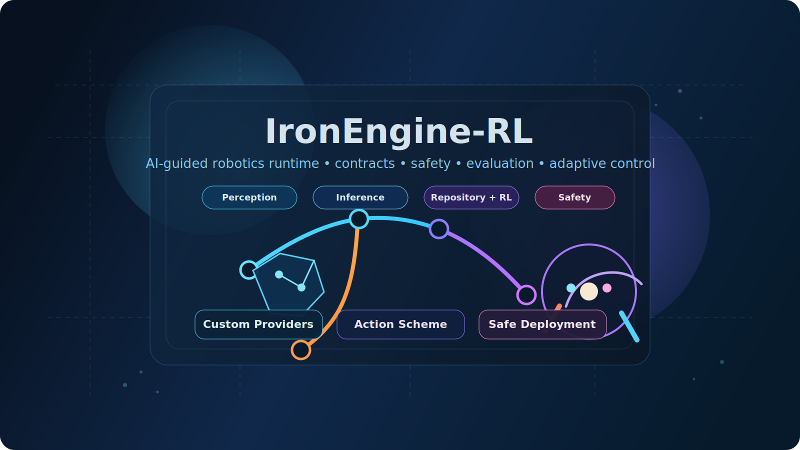
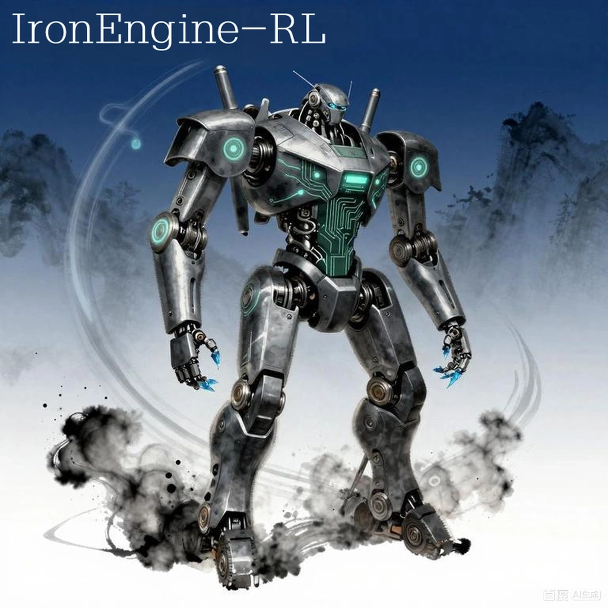
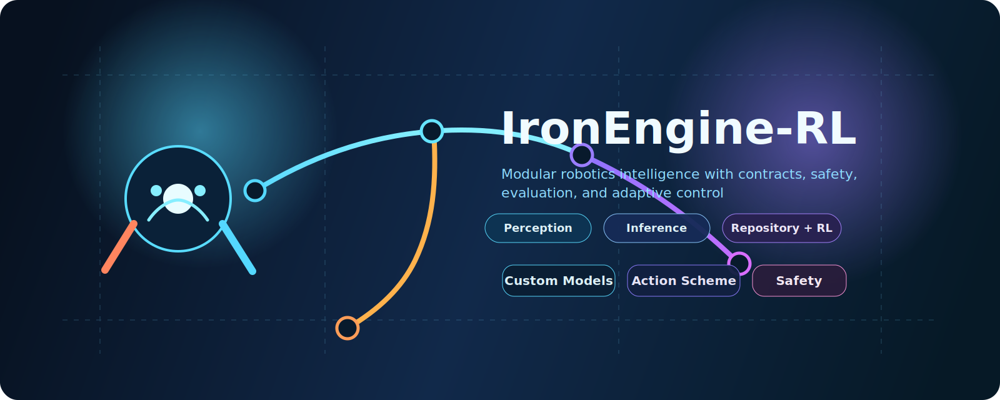
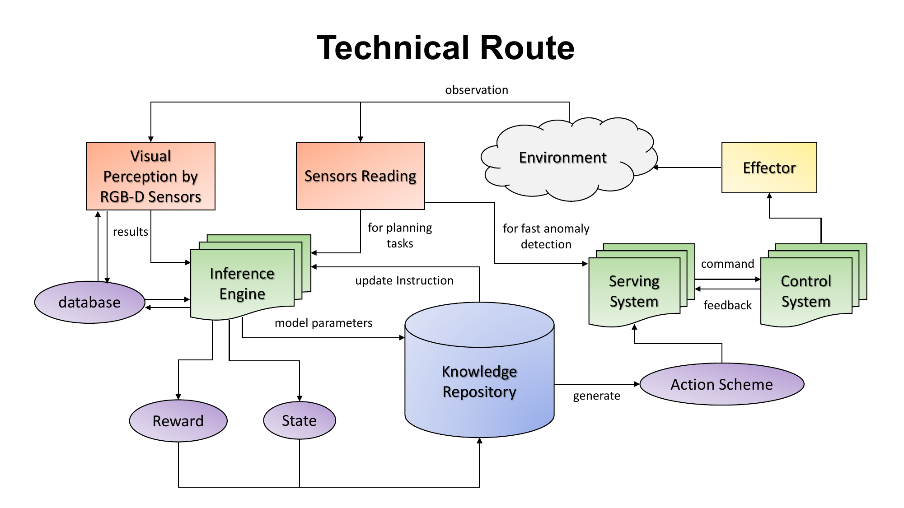
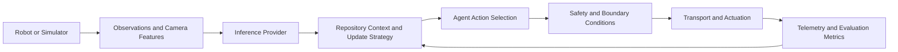
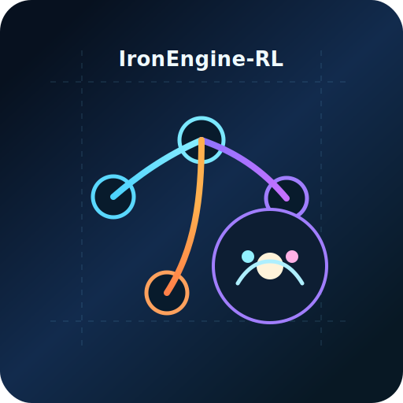

# IronEngine-RL

<p align="center">
  
  
  
  
  
  
  
  
  
  
</p>

<table align="center">
  <tr>
    <td align="center" valign="top">
      
    </td>
    <td align="center" valign="top">
      
    </td>
  </tr>
</table>

<p align="center"><em>Custom iconic hero artwork for <code>IronEngine-RL</code> placed alongside the original iconic image.</em></p>

<p align="center"><strong>A configurable robotics intelligence framework that connects AI models, robot platforms, safety boundaries, and evaluation workflows through standardized interfaces.</strong></p>

<p align="center">
  <a href="#quick-start"></a>
  <a href="#documentation-map"></a>
  <a href="docs/developer-guide.md"></a>
  <a href="#choose-your-starting-path"></a>
</p>

<p align="center">
  
</p>

> `IronEngine-RL` is the configurable brain layer between AI models and robot platforms. It connects perception, inference, repository context, decision making, safety boundaries, and actuation through standardized interfaces so users can change models, transports, agents, and hardware without rewriting the full stack.

`IronEngine-RL` is designed for both research and engineering workflows: deterministic simulation, replay-assisted evaluation, mock hardware validation, real hardware integration, prompt-driven LLM backends, trainable PyTorch models, heuristic baselines, and plugin-loaded custom modules.

## Fast Benefits Snapshot

| Benefit | What you gain quickly |
| --- | --- |
| Lightweight runtime | Start with a lean core path instead of a heavyweight orchestration stack |
| Local-model friendly | Try practical local AI workflows on modest machines with smaller models and compact backends |
| Cross-platform structure | Carry the same framework approach across Windows, Linux, and macOS deployments |
| Scalable complexity | Add persistence, richer models, extra sensors, and HIL only when the project needs them |

**Quick Links:** [Documentation Map](#documentation-map) · [Software Environment Setup](#software-environment-setup) · [Quick Start](#quick-start) · [Choose Your Starting Path](#choose-your-starting-path) · [Runtime Modes at a Glance](#runtime-modes-at-a-glance) · [ARMSmart and Custom Robot Integration](#armsmart-and-custom-robot-integration) · [NiusRobotLab](#niusrobotlab)

> [!NOTE]
> `IronEngine-RL` aims to make robotics stacks easier to change without making them easier to break. The framework is intentionally organized around contracts, validation, safety boundaries, and explicit module surfaces.

<details>
<summary><strong>Brand assets included in this repository</strong></summary>

- `assets/IE-RL-hero.svg` - primary README hero artwork
- `assets/IE-RL-banner.svg` - wide banner asset for docs, slides, or previews
- `assets/IE-RL-mark.svg` - compact emblem-style mark
- `assets/IE-RL.jpg` - original image kept as a reference asset

</details>

## Highlights at a Glance

| Highlight | Why it matters | Where to look |
| --- | --- | --- |
| Swappable intelligence layer | Swap heuristic, PyTorch, local LLM, cloud LLM, or custom providers without rewriting the full runtime | `examples/inference/` and `docs/api-reference.md` |
| Explicit hardware contract | Keep action channels, feedback fields, camera roles, safety, and protocol design visible in profiles | `examples/hardware/` and `docs/custom-robots-and-sensors.md` |
| Lightweight by default | Start with a simple in-memory repository and add persistence only when needed, keeping the core runtime lean | `examples/plugins/persistent_repository/profile.json` |
| Low local-model barrier | Run practical local-model workflows with modest hardware by starting from compact prompt backends and lightweight control paths instead of assuming large GPU servers | `examples/inference/armsmart_ollama/profile.json` and `docs/software-setup.md` |
| Wide platform compatibility | Use the same framework patterns across Windows, Linux, and macOS, then adapt transports and hardware adapters per deployment | `docs/software-setup.md` and `docs/custom-robots-and-sensors.md` |
| Complete end-to-end examples | Study richer ARMSmart examples that combine tasks, metrics, repositories, action schemes, and custom inference | `examples/inference/armsmart_*_complete/` |
| Developer-facing documentation | Use dedicated API and developer docs instead of relying only on source reading | `docs/api-reference.md` and `docs/developer-guide.md` |

## Design Principles

- **Safety stays outside the model:** battery, collision, stale-observation, and motion limits remain enforceable even when inference is wrong
- **Profiles are first-class:** the main user-facing configuration lives in profiles, not hidden wiring scattered across the codebase
- **Additive clarity over breaking renames:** aliases such as `command`, `feedback`, `results`, and `action_scheme` make the framework easier to understand without breaking core types
- **Examples teach the framework:** runnable examples are treated as part of the documentation, not as throwaway demos
- **Persistence is opt-in:** repository and database workflows are available, but the core runtime remains lightweight

## Inspiration and Research Context

`IronEngine-RL` is inspired by the framework interpretation of Figure 7.1 and by the dissertation:

Mo, X. (2022). *Convolutional Neural Network in Pattern Recognition* (Doctoral dissertation, University of Kansas).

The Figure 7.1 reference asset for this repository is stored in `assets/figure-7-1-framework.pdf`. This project takes inspiration from the sources above and turns that conceptual framework into a configurable software system for AI-guided robotics.

<p align="center">
  
</p>

<p align="center"><em>Figure 7.1 reference overview used as inspiration for the <code>IronEngine-RL</code> architecture.</em></p>

## What IronEngine-RL Provides

| Area | What it provides |
| --- | --- |
| Runtime core | A configurable runtime between AI reasoning modules and robots |
| Contracts | Standardized observation, action, camera-role, safety, and repository-context interfaces |
| Validation | Schema and compatibility checks before strict execution |
| Extensibility | Pluggable inference providers, agents, metrics, safety policies, and update strategies |
| Deployment path | A clean path from mock bring-up to hardware-in-the-loop and real robot deployment |
| Reference platform | A complete ARMSmart integration plus generalized templates for other robots |
| Efficiency profile | A lightweight default stack that avoids forcing persistence layers, oversized orchestration, or heavy model serving for every use case |
| Practical local AI path | Support for compact local-model workflows so teams can prototype without high-end server hardware |
| Platform reach | Cross-platform project structure that can be adapted for Windows, Linux, and macOS environments |

## Why IronEngine-RL?

- **For research:** compare heuristic, prompt-driven, and trainable policies within one consistent runtime
- **For hardware integration:** standardize sensors, action channels, timing rules, and safety boundaries before motion
- **For iteration speed:** move from simulation to replay, mock hardware, HIL, and real hardware without rewriting the whole control stack
- **For extensibility:** add custom plugins for inference, agents, metrics, safety policies, and update strategies
- **For maintainability:** keep robot-specific details in profiles, adapters, and plugins instead of scattering them across the project
- **For lightweight deployment:** keep the default runtime lean so smaller robots, edge PCs, and lab workstations are not forced into heavyweight infrastructure
- **For accessible local AI:** begin with smaller local-model setups and compact prompt workflows before deciding whether larger hardware is justified
- **For wide compatibility:** use one framework structure across multiple operating systems and deployment styles, then tailor adapters instead of forking the architecture

## Practical Benefits

| Benefit | What this means in practice |
| --- | --- |
| Lightweight runtime | The framework can start with mock hardware, rule-based control, or small local-model integrations without requiring a large orchestration stack |
| Lower hardware requirements for local models | Users can evaluate local LLM or prompt-style workflows on comparatively modest machines by choosing smaller models and lightweight backends such as Ollama or LM Studio-compatible paths |
| Efficient customization path | Profiles, plugins, and scaffolded configs reduce the amount of custom glue code needed to integrate a new robot or AI backend |
| Wide platform compatibility | The framework organization is portable across common development environments, while transports and adapters absorb most platform-specific differences |
| Gradual scaling | Teams can begin with simple baselines, then add persistence, richer models, extra sensors, or hardware-in-the-loop only when the project actually needs them |

## Common Use Cases

| Use case | What teams do with `IronEngine-RL` |
| --- | --- |
| Research labs | Compare multiple control or reasoning backends against the same observation and action contracts |
| Robot builders | Bring up new sensors, MCU firmware, and motion interfaces safely through mock and HIL stages |
| AI integration teams | Swap local LLMs, cloud APIs, and trainable policies without rewriting the robot-facing runtime |
| Education and prototyping | Demonstrate end-to-end AI-guided robotics workflows with examples that are easier to explain and modify |

## Who This Repository Is For

| Audience | What you likely care about | Best first stop |
| --- | --- | --- |
| Robotics researchers | comparing reasoning backends with a stable runtime contract | `docs/framework-architecture.md` |
| Embedded and robot integration engineers | transport, protocol, telemetry shape, and safety control | `examples/hardware/armsmart/profile.mock.json` |
| ML and LLM developers | custom providers, prompt-driven workflows, adaptive policies, and repository context | `examples/inference/` and `docs/api-reference.md` |
| Framework extenders | plugin surfaces, testing, and contribution flow | `docs/developer-guide.md` |

## Repository Guide

| Path | Purpose |
| --- | --- |
| `src/ironengine_rl/` | Core framework implementation |
| `profiles/` | Reusable reference profiles for scaffolding, validation, tests, and canonical starting configurations |
| `examples/` | Runnable scenario-specific profiles that show complete hardware, inference, or plugin workflows |
| `user_modules/` | Custom and example plugin modules |
| `docs/` | Supporting documentation beyond this main README |
| `assets/` | Figure and reference assets |
| `tools/` | Optional helper scripts and developer utilities when the project needs repository-maintenance helpers |

### What `profiles/` is for

Use `profiles/` when you want the framework's reusable baseline configurations. These profiles are intended to be stable reference inputs for validation, scaffolding, automated tests, and quick adaptation into your own robot or inference setup.

Use `examples/` when you want a more opinionated, runnable demonstration such as ARMSmart mock hardware, local/cloud LLM integration, custom PyTorch stacks, or repository plugins working together end to end.

A practical rule is: start by reading or validating a file in `profiles/`, then move to `examples/` when you want a complete scenario, and finally copy either into your own custom profile once the workflow is clear.

### Project Tree

```text
IronEngine-RL/
├─ assets/
├─ docs/
├─ examples/
├─ logs/
├─ profiles/
├─ src/ironengine_rl/
├─ tests/
├─ user_modules/
├─ .gitignore
├─ pyproject.toml
├─ README.md
└─ requirements.txt
```

The `tools/` folder is optional and is not present in the current tree. Add it only when you intentionally need helper scripts such as migration tools, release automation, converters, or local developer utilities.
## Relationship to `IronEngine`

`IronEngine-RL` is closely related to the broader [`IronEngine`](https://github.com/dunknowcoding/IronEngine) project, but it is intentionally narrower in scope.

`IronEngine` is described as a next-generation universal AI assistant that connects local and cloud agents to real-life operations across common operating systems. `IronEngine-RL` takes a simplified core idea from that project—the configurable connection between AI reasoning, real-world interfaces, and operational control—and optimizes it for reinforcement-learning-oriented robotics workflows.

In practice, this means `IronEngine-RL` keeps the parts that matter most for robot learning and control loops:

- standardized observation, action, safety, and repository interfaces
- explicit profile-driven configuration instead of hidden orchestration
- modular inference backends such as heuristic, PyTorch, local LLM, cloud LLM, and custom plugins
- validation, task evaluation, and boundary enforcement around every run
- a practical path from simulation to mock hardware, HIL, and real robot deployment

At the same time, `IronEngine-RL` is deliberately lighter than the broader `IronEngine` vision. It does not try to be a general-purpose universal assistant runtime. Instead, it specializes the architecture around robotics, task execution, policy iteration, reward-driven analysis, and repeatable experiment workflows.

### How to think about the relationship

- `IronEngine` - broader universal AI assistant direction
- `IronEngine-RL` - reinforcement-learning and robotics-focused specialization built around a simplified core framework idea
- shared spirit - modular AI integration, practical deployment, and local/cloud flexibility
- different optimization target - `IronEngine-RL` is tuned for task-oriented robot control, evaluation, safety, and experimentation

So if `IronEngine` represents the larger vision, `IronEngine-RL` represents a focused engineering branch optimized for reinforcement learning, robot task execution, and configurable embodied AI experiments.
## Documentation Map

| Document | Purpose |
| --- | --- |
| `docs/index.md` | Documentation entry point |
| `docs/software-setup.md` | Python environment setup, dependency roles, external tools, and bring-up notes |
| `docs/troubleshooting.md` | Common setup, validation, plugin, LLM, PyTorch, and hardware bring-up issues |
| `docs/profiles-and-configuration.md` | How profiles are structured and how to edit them effectively |
| `docs/anomaly-detection-and-safety.md` | How anomaly signals flow through inference, safety, and customization paths |
| `docs/examples-matrix.md` | Feature comparison across the main example profiles |
| `docs/api-reference.md` | Public runtime APIs, datamodels, extension ports, and CLI surfaces |
| `docs/developer-guide.md` | Detailed guidance for framework developers, extenders, and maintainers |
| `docs/repository-layout.md` | Repository structure and the purpose of `tools/` |
| `docs/framework-architecture.md` | Architecture, framework philosophy, and design surfaces |
| `docs/figure-7-1-mapping.md` | Direct mapping from Figure 7.1 concepts to framework modules, aliases, and examples |
| `docs/customization.md` | Customization patterns for modules, contracts, ARMSmart, and scaffolding |
| `docs/custom-robots-and-sensors.md` | Practical requirements for customized robots, sensors, interfaces, and MCUs |
| `docs/examples-and-workflows.md` | Example catalog and recommended user path |
| `docs/plugins-and-extensions.md` | Plugin organization and extension points |
| `docs/logging-and-outputs.md` | How runtime outputs should be organized |
| `docs/references.md` | Dissertation citation and figure reference |

<details>
<summary><strong>Suggested reading paths</strong></summary>

- **I want the big picture:** `README.md` → `docs/framework-architecture.md` → `docs/figure-7-1-mapping.md`
- **I want to build or extend the framework:** `docs/api-reference.md` → `docs/developer-guide.md` → `docs/plugins-and-extensions.md`
- **I want to understand profiles first:** `docs/profiles-and-configuration.md` → `docs/examples-and-workflows.md` → `profiles/`
- **I want to run examples quickly:** `README.md` → `docs/examples-and-workflows.md` → `docs/examples-matrix.md` → `examples/`
- **I want to integrate hardware:** `docs/custom-robots-and-sensors.md` → `examples/hardware/` → `docs/logging-and-outputs.md`
- **I want to customize anomaly handling:** `docs/anomaly-detection-and-safety.md` → `examples/plugins/anomaly_customization/profile.json`
- **I am stuck on setup or validation:** `docs/troubleshooting.md` → `docs/software-setup.md` → `docs/developer-guide.md`

</details>

## Inference Backend Matrix

| Backend type | Style | Best use | Requires weights | Requires external service |
| --- | --- | --- | --- | --- |
| `rule_based` | Heuristic baseline | Deterministic reference behavior and simple validation | No | No |
| `linear_policy` | Lightweight trainable weights | Small framework-managed control policies | Yes | No |
| `pytorch_trainable` | Trainable PyTorch model | Custom learning workflows and trainable controllers | Yes | No |
| `ollama_prompt` | Prompt-driven local model | Local reasoning with an Ollama-served model | No | Yes, local |
| `lmstudio_prompt` | Prompt-driven local model | Local reasoning with LM Studio | No | Yes, local |
| `cloud_prompt` | Prompt-driven cloud model | Hosted LLM reasoning through a cloud API | No | Yes, remote |
| `custom_plugin` | User-defined custom provider | Specialized inference logic or custom model wrappers | Depends | Depends |

## Software Environment Setup

### Core requirements

- Python `>=3.10`
- `pip` or Conda for package management
- a Windows, Linux, or macOS environment able to access your robot interface
- optional GPU support if you plan to use larger PyTorch models

For a fuller environment checklist and bring-up notes, see `docs/software-setup.md`.

<details>
<summary><strong>Option A: <code>venv</code> example</strong></summary>

```powershell
python -m venv .venv\IronEngine-RL
.\.venv\IronEngine-RL\Scripts\Activate.ps1
python -m pip install --upgrade pip
python -m pip install -r requirements.txt
```

</details>

<details>
<summary><strong>Option B: Conda example</strong></summary>

```powershell
conda create -n IronEngine-RL python=3.11 -y
conda activate IronEngine-RL
python -m pip install --upgrade pip
python -m pip install -r requirements.txt
```

</details>

### Optional runtime dependencies

- `pyserial` for serial-connected MCUs or motor controllers
- `opencv-python` for USB or onboard camera capture
- `torch` for custom PyTorch providers and trainable models
- `requests` for local LLM servers and cloud API integrations

### External software you may also need

- camera drivers for your selected devices
- serial drivers for USB-to-UART or USB-CAN interfaces
- Ollama or another local model runtime if using local prompt backends
- cloud API credentials in environment variables if using hosted inference

## Quick Start

### First mock validation run

1. Create and activate either the `venv` or Conda environment shown above.
2. Install dependencies from `requirements.txt`.
3. Validate the mock ARMSmart profile.
4. Run a short mock example episode.
5. Inspect the framework description or run the test suite if needed.

```powershell
python -m ironengine_rl.validate --profile examples\hardware\armsmart\profile.mock.json --strict
python -m ironengine_rl.cli --profile examples\hardware\armsmart\profile.mock.json --episodes 1 --steps 12
python -m ironengine_rl.describe --profile profiles\framework_customizable\profile.json
python -m unittest discover -s tests -p "test_*.py" -v
```

> Tip: keep the active environment selected before running `python -m ...` commands so the correct interpreter and installed dependencies are used.

> [!TIP]
> If you are brand new to the framework, start with mock hardware first, then inspect the manifest and validation output before trying any custom provider or hardware integration.

<details>
<summary><strong>What you get from the first four commands</strong></summary>

- `validate` checks schema and compatibility before risky execution
- `cli` runs a short episode so you can verify logs and runtime flow
- `describe` prints framework, platform, and compatibility information for inspection
- `unittest` confirms the repository examples and framework behaviors still pass regression checks

</details>

## Choose Your Starting Path

| Path | Best if you want to... | Start here |
| --- | --- | --- |
| `Mock bring-up` | verify contracts, safety, and telemetry flow without touching hardware | `examples/hardware/armsmart/profile.mock.json` |
| `Custom hardware onboarding` | adapt a new robot, MCU, sensors, and transport interface in a controlled sequence | `examples/hardware/custom_robots/template.profile.json` |
| `LLM-guided robotics` | test local or hosted prompt backends on top of a stable hardware contract | `examples/inference/armsmart_ollama/profile.json` or `examples/inference/armsmart_cloud_api/profile.json` |
| `Complete ARMSmart local LLM stack` | try a richer local-LLM workflow with repository context, action-scheme metadata, and a custom task | `examples/inference/armsmart_ollama_complete/profile.json` |
| `Complete ARMSmart cloud LLM stack` | try a richer cloud-LLM workflow with repository context, action-scheme metadata, and a custom task | `examples/inference/armsmart_cloud_complete/profile.json` |
| `Custom trainable model` | plug in a PyTorch-backed reasoning module or your own provider | `examples/inference/armsmart_pytorch_custom/profile.json` |
| `Complete ARMSmart PyTorch stack` | use a custom provider, custom update rules, custom task, custom metric, custom agent, and persistent repository together | `examples/inference/armsmart_pytorch_complete/profile.json` |
| `Anomaly customization` | experiment with custom anomaly labels and safety routing before hardware bring-up | `examples/plugins/anomaly_customization/profile.json` |
| `Persistent repository and action scheme` | keep the runtime lightweight by default, but try an opt-in repository plugin and explicit action-scheme metadata | `examples/plugins/persistent_repository/profile.json` |
| `Scaffold from scratch` | generate a new profile with an explicit `action_scheme` automatically included | `python -m ironengine_rl.scaffold --output profiles\my_robot\profile.json --guided-goal custom_hardware --name my_robot --guided-backend udp --overwrite` |

These quick paths are meant to reduce setup friction: stabilize one layer first, then introduce the next variable.

## At-a-Glance Decision Guide

| If your main question is... | Use this first | Why |
| --- | --- | --- |
| "Does my robot contract even make sense?" | `python -m ironengine_rl.validate --profile ... --strict` | validation is the safest first gate |
| "Can I test without moving real hardware?" | `examples/hardware/armsmart/profile.mock.json` | mock transport gives safe telemetry and control-loop coverage |
| "How do I integrate my own model?" | `examples/inference/armsmart_pytorch_custom/profile.json` or `examples/inference/armsmart_pytorch_complete/profile.json` | these show custom provider patterns from simple to full-stack |
| "How do I use local or cloud LLMs?" | `examples/inference/armsmart_ollama_complete/profile.json` or `examples/inference/armsmart_cloud_complete/profile.json` | they show prompt-context composition using repository and action-scheme metadata |
| "How do I customize anomaly handling?" | `docs/anomaly-detection-and-safety.md` and `examples/plugins/anomaly_customization/profile.json` | they show how custom anomaly labels can drive warning-only or stop behavior |
| "Where do I start as a contributor?" | `docs/developer-guide.md` | it explains source layout, extension points, and test expectations |
## Architecture Flow



This flow shows the core idea behind `IronEngine-RL`: observations are interpreted by a swappable inference layer, combined with repository context, converted into actions by an agent, constrained by safety boundaries, and then executed through a hardware or simulation transport while evaluation feedback closes the loop.

<details>
<summary><strong>Read the flow as a practical engineering loop</strong></summary>

1. sensors and cameras provide structured observations
2. a provider turns them into task phase, state estimate, and reward hints
3. the repository contributes context, memory, and optional persistence
4. the agent chooses commands under the active `action_scheme`
5. the safety layer clamps or replaces unsafe actions before they reach hardware
6. evaluation and logs make the next iteration easier to debug and compare

</details>

## Runtime Modes at a Glance

| Mode | Best use | Hardware required | Safety focus | Typical starting point |
| --- | --- | --- | --- | --- |
| Deterministic simulation | Logic and reward iteration | No | Boundary logic and task flow | Simulation profiles in `profiles/` |
| Replay-assisted simulation | Regression checks with recorded observations | No | Contract and perception consistency | Replay-enabled simulation profiles |
| Mock hardware | Transport and telemetry validation | No real robot | Command mapping and telemetry shape | `examples/hardware/armsmart/profile.mock.json` |
| HIL | Device integration before full deployment | Partial or full hardware | Transport timing, sensors, cameras | `examples/hardware/armsmart/profile.hil.json` |
| Real hardware | End-to-end deployment | Yes | Full runtime safety, stale observation handling, battery and collision limits | A validated HIL or custom hardware profile |

> [!IMPORTANT]
> The recommended progression is still: `validation` → `mock` → `HIL` → `real hardware`. Even when the model is exciting, the safest workflow is still the fastest overall workflow.

## Main Workflows

| Workflow | Starting point | Purpose |
| --- | --- | --- |
| ARMSmart mock validation | `examples/hardware/armsmart/profile.mock.json` | Safest first validation path for transport, safety, and telemetry |
| ARMSmart HIL | `examples/hardware/armsmart/profile.hil.json` | Hardware-in-the-loop ARMSmart setup |
| New robot onboarding | `examples/hardware/custom_robots/template.profile.json` | Grouped-hardware template for a new robot |
| Local LLM backend | `examples/inference/armsmart_ollama/profile.json` | Local Ollama reasoning |
| Complete local LLM backend | `examples/inference/armsmart_ollama_complete/profile.json` | Local LLM planning with repository/database context and explicit action-scheme notes |
| Hosted API backend | `examples/inference/armsmart_cloud_api/profile.json` | Hosted API reasoning |
| Complete cloud LLM backend | `examples/inference/armsmart_cloud_complete/profile.json` | Cloud LLM planning with repository/database context and explicit action-scheme notes |
| Custom model backend | `examples/inference/armsmart_pytorch_custom/profile.json` | Custom PyTorch reasoning |
| Complete PyTorch backend | `examples/inference/armsmart_pytorch_complete/profile.json` | Custom PyTorch provider plus custom policy/weight update rules, task, metric, and repository |

## What the Complete Examples Demonstrate

| Example family | What it adds beyond the basic examples |
| --- | --- |
| `armsmart_pytorch_complete` | custom adaptive provider, reward-aware update rules, custom task, custom metric, action-scheme-aware agent, and persistent repository/database traces |
| `armsmart_ollama_complete` | richer local LLM prompt context using repository state, database metadata, and explicit action-scheme notes |
| `armsmart_cloud_complete` | richer cloud LLM prompt context using repository state, success summaries, and explicit action-scheme notes |

<p align="center">
  
</p>

## Transport and Interface Comparison

| Transport or interface | Best use | Strengths | Design notes |
| --- | --- | --- | --- |
| `mock` | Early validation and regression-friendly bring-up | Fast, safe, reproducible, and easy to inspect in logs | Use this first when changing contracts, agents, or safety rules |
| `serial` | MCU-connected robots, motor controllers, and embedded bring-up | Simple wiring, broad hardware support, common for UART-based controllers | Define baud rate, packet framing, retries, and disconnect behavior clearly |
| `udp` | Networked controllers, external compute nodes, or low-latency LAN links | Flexible deployment and easy separation of compute from hardware | Plan for packet loss, heartbeat rules, and explicit timeout handling |
| `CAN gateway` | Multi-device actuator buses exposed through a bridge | Good fit for structured motor networks and robust field devices | Usually integrated through an adapter layer rather than directly in the agent logic |

The exact transport can vary by robot, but the framework expectation stays the same: commands and telemetry must match the declared contracts, and safety rules must remain enforceable even when the link becomes stale or noisy.

## ARMSmart and Custom Robot Integration

### ARMSmart reference path

1. Validate `examples/hardware/armsmart/profile.mock.json`.
2. Inspect the generated output under `logs/examples/hardware/armsmart/mock`.
3. Use `examples/hardware/armsmart/diagnose_mock.ps1` for a quick PowerShell check.
4. Move to `examples/hardware/armsmart/profile.hil.json` only after the mock path is stable.
5. Swap inference backends later through `examples/inference/` without changing the hardware contract first.
6. Use the `*_complete` examples when you want end-to-end customization of action scheme, repository/database storage, evaluation task, metrics, and inference behavior.

### Requirements for customized hardware

A customized robot should provide the following at minimum:

| Requirement | What it means in practice |
| --- | --- |
| Sensors | Telemetry needed by the chosen task, such as battery health, collision risk, arm position, gripper state, target offsets, and optional camera-derived features |
| Robot interface | A stable communication path such as serial, UDP, CAN gateway, or another controller interface that can send commands and return telemetry predictably |
| MCU or controller behavior | Safe startup defaults, repeatable command parsing, telemetry publishing, disconnect handling, and ideally an emergency-stop or passive-stop mode |
| Observation contract | Named sensor fields and camera roles that match the active platform, inference, and evaluation contracts |
| Action contract | Command channels for chassis, arm, wrist, gripper, or other actuators that the agent and safety layers can reason about |
| Timing assumptions | A known update rate, transport timeout, and stale-observation handling rule |
| Workflow discipline | Start with mock transport, validate compatibility, add realistic telemetry, then move to HIL and finally to real hardware |

### Recommended integration workflow

1. Start from `examples/hardware/custom_robots/template.profile.json`.
2. Define the robot contract in `hardware.platform.capabilities`.
3. Configure transport in `hardware.connection`, protocol IDs in `hardware.protocol`, sensors and cameras in `hardware.cameras`, and limits in `hardware.safety`.
4. If needed, adapt your MCU firmware or controller software so telemetry and commands match the declared contract.
5. Add custom plugins in `user_modules/` only when the built-in modules are not enough.
6. Run `ironengine_rl.validate` before any strict or hardware-facing execution.
7. If you are using the complete PyTorch example, optionally generate a demo weights file with `python examples\inference\armsmart_pytorch_complete\generate_demo_weights.py` before running the profile.

<details>
<summary><strong>Why this workflow matters</strong></summary>

The fastest way to make robotics integration unsafe is to combine new firmware, new hardware, and new AI behavior in one step. `IronEngine-RL` is structured so you can validate the contract first, then the transport, then the safety layer, and only afterward the reasoning backend.

</details>

<details>
<summary><strong>Suggested next reads after this README</strong></summary>

- read `docs/api-reference.md` if you want the public runtime symbols and extension surfaces
- read `docs/developer-guide.md` if you want testing and contribution guidance
- read `docs/customization.md` if you want to design your own profiles or plugins
- read `docs/examples-and-workflows.md` if you want the shortest path to a runnable example

</details>

## License

This project is licensed under the `PolyForm Noncommercial License 1.0.0`.

See the full text in [`LICENSE`](LICENSE).

See the redistribution notice in [`NOTICE`](NOTICE).

Required Notice: Copyright 2026 DunknowCoding

This license allows noncommercial use, modification, and distribution under the license terms, but it does not allow commercial use.

If you need commercial-use rights, contact `DunknowCoding` to arrange separate licensing terms for this repository.

## NiusRobotLab

<p align="center">
  
</p>

If you are interested in robotics experiments, AI-guided hardware integration, and future `IronEngine-RL` demonstrations, please check out the `NiusRobotLab` YouTube channel.

If you enjoy the project and want to follow future work, please subscribe to `NiusRobotLab`.
## Verified Custom-Model Workflow

If you want the most complete customized-model path, start from `examples/inference/armsmart_pytorch_complete/profile.json` and the companion walkthrough `examples/inference/armsmart_pytorch_complete/grasp_process.md`.

### Recommended setup order

```powershell
python -m pip install -r requirements.txt
python -m pip install torch
python examples\inference\armsmart_pytorch_complete\generate_demo_weights.py
python -m ironengine_rl.cli --profile examples\inference\armsmart_pytorch_complete\profile.json --validate-only --strict
python tools\run_armsmart_pytorch_grasp_trial.py
```

### What this verified path demonstrates

- the provider can load `weights_file` when `torch` is available
- the custom update strategy still changes the effective policy state even with a live PyTorch model
- the agent shapes actions under `armsmart_pick_place_schedule`
- the repository writes `state_trace`, `reward_trace`, and `policy_trace`
- the grasp process can be inspected step by step through `approach`, `pregrasp`, and `grasp_or_lift`

### Notices for customized models

- if `torch` or the weights file is missing, the complete example still runs by falling back to an analytic policy
- generate or place weights before comparing learned behavior across runs
- validate the profile before switching from mock or simulation paths to hardware-facing paths
- inspect the run directory after each trial, especially `summary.json`, `armsmart_experiment_db.json`, and `grasp_trial_report.json`

Use the basic custom-provider example when you only need a plugin pattern, and use the complete example when you want verified interaction between provider, update strategy, task, agent, and repository.
## Task-Oriented LLM Setup

When you use an LLM-backed provider, the user should set the mission in the profile through `llm.task`, and the framework should load `SOUL.md` for every prompt.

### Where the user sets the task

```json
{
  "llm": {
    "role_contract_file": "SOUL.md",
    "task": {
      "name": "right_object_grasp",
      "goal": "Grasp the right object on the work surface and avoid non-target objects.",
      "success_criteria": [
        "keep the correct target selected during approach",
        "enter pregrasp only when the target is aligned and reachable",
        "finish the grasp without violating safety limits"
      ],
      "constraints": [
        "respect the action scheme",
        "do not bypass the safety controller"
      ],
      "output_requirements": [
        "return a framework-compatible control phase",
        "stay grounded in visible detections and repository context"
      ]
    }
  }
}
```

### Task settings quick reference

- `llm.role_contract_file` - usually `SOUL.md`, the role contract prepended to each prompt
- `llm.task.name` - short stable identifier for the mission
- `llm.task.goal` - the main user objective in plain language
- `llm.task.success_criteria` - concrete completion checks the model should keep in mind
- `llm.task.constraints` - hard behavior limits such as safety and action-scheme compliance
- `llm.task.output_requirements` - optional instructions about the expected answer format or decision style
- `action_scheme` - the allowed control surface and schedule notes the provider should follow
- `evaluation.task` - the framework task used for evaluation and metrics, separate from the LLM mission text

### When to use provider-level overrides

Use the top-level `llm` block by default. Only set provider-local overrides when one backend needs a different role contract or a different mission than the rest of the profile.

```json
{
  "model_provider": {
    "type": "ollama_prompt",
    "role_contract_file": "SOUL.md",
    "task": {
      "name": "cloth_fold_and_place",
      "goal": "Fold the cloth neatly and place it into the tray.",
      "constraints": [
        "respect the active action scheme",
        "do not exceed safety limits"
      ]
    }
  }
}
```

### What happens during prompting

1. `SOUL.md` defines the LLM role inside `IronEngine-RL`
2. `llm.task` provides the user mission
3. the action scheme, repository context, and current observation are added
4. the provider asks for the next framework-compatible control phase

### Practical rule of thumb

- put user intent in `llm.task`
- keep runtime scoring in `evaluation.task`
- keep control limits in `action_scheme` and `safety`
- use provider overrides only when one provider genuinely needs different task wording

Use `docs/llm-task-and-soul.md` for the dedicated workflow and `docs/profiles-and-configuration.md` for profile editing guidance.
### Copyable Task Examples

#### Multi-object grasping

```json
{
  "llm": {
    "role_contract_file": "SOUL.md",
    "task": {
      "name": "multi_object_target_grasp",
      "goal": "Pick up the red mug on the right side of the table and ignore the blue box and green bottle.",
      "success_criteria": [
        "keep the red mug selected as the target during approach",
        "do not switch to distractor objects when detections fluctuate",
        "enter pregrasp only when the target is aligned and reachable",
        "finish the grasp without violating safety limits"
      ],
      "constraints": [
        "respect the action scheme",
        "do not bypass the safety controller",
        "use only visible detections and repository context for target selection"
      ],
      "output_requirements": [
        "return the next framework-compatible control phase",
        "state why the selected target is still the correct object if ambiguity exists"
      ]
    }
  },
  "evaluation": {
    "task": "tabletop_grasp"
  }
}
```

#### Cloth fold and place

```json
{
  "llm": {
    "role_contract_file": "SOUL.md",
    "task": {
      "name": "cloth_fold_and_place",
      "goal": "Fold the cloth neatly and place it into the right tray.",
      "success_criteria": [
        "align the cloth before folding",
        "complete the fold sequence without unsafe arm motion",
        "place the folded cloth into the correct tray"
      ],
      "constraints": [
        "respect the action scheme",
        "keep motion within safety and reach limits"
      ],
      "output_requirements": [
        "return the next task phase in the fold workflow",
        "prefer stable staged actions over abrupt motion changes"
      ]
    }
  },
  "evaluation": {
    "task": "tabletop_grasp"
  }
}
```

#### Inspection route

```json
{
  "llm": {
    "role_contract_file": "SOUL.md",
    "task": {
      "name": "inspection_route_followup",
      "goal": "Inspect checkpoint A, then B, then C, and report any anomaly before continuing.",
      "success_criteria": [
        "visit checkpoints in order",
        "pause and report if an anomaly is detected",
        "complete the route without violating navigation or safety limits"
      ],
      "constraints": [
        "respect the active action scheme",
        "do not skip anomaly handling",
        "do not continue to the next checkpoint if safety requires a stop"
      ],
      "output_requirements": [
        "return the next framework-compatible control phase",
        "keep the checkpoint state consistent with repository memory"
      ]
    }
  }
}
```

Use these as starting points, then adapt `goal`, `success_criteria`, and `constraints` to your robot, sensors, and task phases.
### Full Profile Example

The fragment below shows a practical task-oriented profile slice for a multi-object grasping workflow. It puts the user mission, evaluation label, action scheme, safety limits, and provider backend in one place.

```json
{
  "model_provider": {
    "type": "ollama_prompt",
    "model": "qwen3.5:2b",
    "base_url": "http://127.0.0.1:11434",
    "timeout_s": 20.0
  },
  "llm": {
    "role_contract_file": "SOUL.md",
    "task": {
      "name": "multi_object_target_grasp",
      "goal": "Pick up the red mug on the right side of the table and ignore the blue box and green bottle.",
      "success_criteria": [
        "keep the red mug selected during approach",
        "enter pregrasp only when the target is aligned and reachable",
        "finish the grasp without violating safety limits"
      ],
      "constraints": [
        "respect the action scheme",
        "do not bypass the safety controller",
        "use visible detections and repository context for target selection"
      ],
      "output_requirements": [
        "return the next framework-compatible control phase",
        "ground the decision in current detections"
      ]
    }
  },
  "evaluation": {
    "task": "tabletop_grasp",
    "metrics": ["task_performance", "boundary_violations"]
  },
  "action_scheme": {
    "name": "target_first_grasp_schedule",
    "schedule_notes": [
      "approach before aggressive arm extension",
      "prefer target stability over fast target switching",
      "only enter grasp when alignment and safety are acceptable"
    ]
  },
  "safety": {
    "collision_stop_threshold": 0.8,
    "low_battery_stop_threshold": 0.15,
    "stale_observation_stop_steps": 3
  },
  "repository": {
    "type": "knowledge_repository"
  }
}
```

Start from this shape, then replace the task wording, model backend, action-scheme notes, and safety thresholds for your own robot and workspace.
### Runnable Example

A ready-to-run task-oriented profile now lives at `examples/inference/task_oriented_multi_object_grasp/profile.json`.

Use `tools/run_task_oriented_multi_object_grasp_trial.py` when you want a short deterministic simulation run that exercises the task settings without requiring live local-model responses.
## TODOs

The framework already covers the core runtime loop, but the next high-value work should stay explicitly task-oriented so users can map research ideas to runnable robotics workflows.

For the structured version of this list, see `docs/roadmap.md`.

### Task-Oriented Designs

- add more reusable task blueprints for grasping, sorting, insertion, stacking, docking, inspection, and recovery workflows
- add task templates that separate `goal`, `success_criteria`, `constraints`, `phase_gates`, and `failure_recovery`
- expand `SOUL.md` and `llm.task` examples for multi-stage missions, multi-object manipulation, and human-in-the-loop supervision
- add reference task packs for ARMSmart, mobile manipulators, and sensor-rich field robots
- add clearer examples that compare LLM-guided task decomposition against custom PyTorch policy execution on the same task

### Unit Tests and Validation

- add more end-to-end tests for complete example profiles, especially custom-model, anomaly-routing, and repository-backed workflows
- add regression tests for `SOUL.md` loading, `llm.task` propagation, and prompt composition edge cases
- add deterministic tests for policy-phase transitions such as `approach`, `pregrasp`, `grasp`, `lift`, and `place`
- add repository assertions for long-run `state_trace`, `reward_trace`, `policy_trace`, and update-log consistency
- add stricter validation coverage for profile path resolution, optional weights files, and custom-plugin contract mismatches

### Optimization

- optimize local-model control loops for shorter prompts, lower latency, and better fallback behavior on small models
- optimize custom PyTorch examples for clearer online adaptation signals and cheaper verification runs
- add profiling helpers for inference latency, transport timing, and repository write overhead
- add caching and batching strategies where they improve repeatability without hiding control decisions
- reduce setup friction for repeated example runs by improving weight generation, reusable run presets, and environment diagnostics

### Visualization Tools

- add a lightweight run visualizer for `summary.json`, `transitions.jsonl`, and repository database files
- add policy-phase timeline views for `approach`, `pregrasp`, `grasp`, `grasp_or_lift`, and safety overrides
- add reward-component plots for progress, alignment, visibility, safety, and success over time
- add camera and detection overlays for replay-based debugging and target-selection analysis
- add comparison dashboards for multiple runs so users can inspect model variants and update-strategy changes side by side

### Simulation Tools

- add richer simulation presets for cluttered scenes, distractor-heavy grasping, partial occlusion, and recovery scenarios
- add more deterministic simulation harnesses for documentation-grade verification of task-oriented workflows
- add replay-assisted simulation tools that combine saved observations, camera frames, and repository state for debugging
- add fault-injection presets for communication drops, battery degradation, sensor drift, and camera failures
- add simulation tools for curriculum-style task progression from simple tabletop grasping to multi-stage manipulation

### Future Improvements

- add a first-class experiment runner for repeated profile sweeps, ablations, and benchmark summaries
- add better developer tooling around custom modules, including template generators and contract-aware scaffolds
- add optional web-based inspection tools for logs, traces, and simulation outputs
- add stronger documentation for migration paths from mock validation to HIL and real hardware
- add more polished example bundles that include setup, deterministic runner scripts, expected outputs, and troubleshooting notes in one place

This TODO list is intentionally practical: each item should eventually map to a runnable profile, a testable workflow, or an inspectable output artifact.